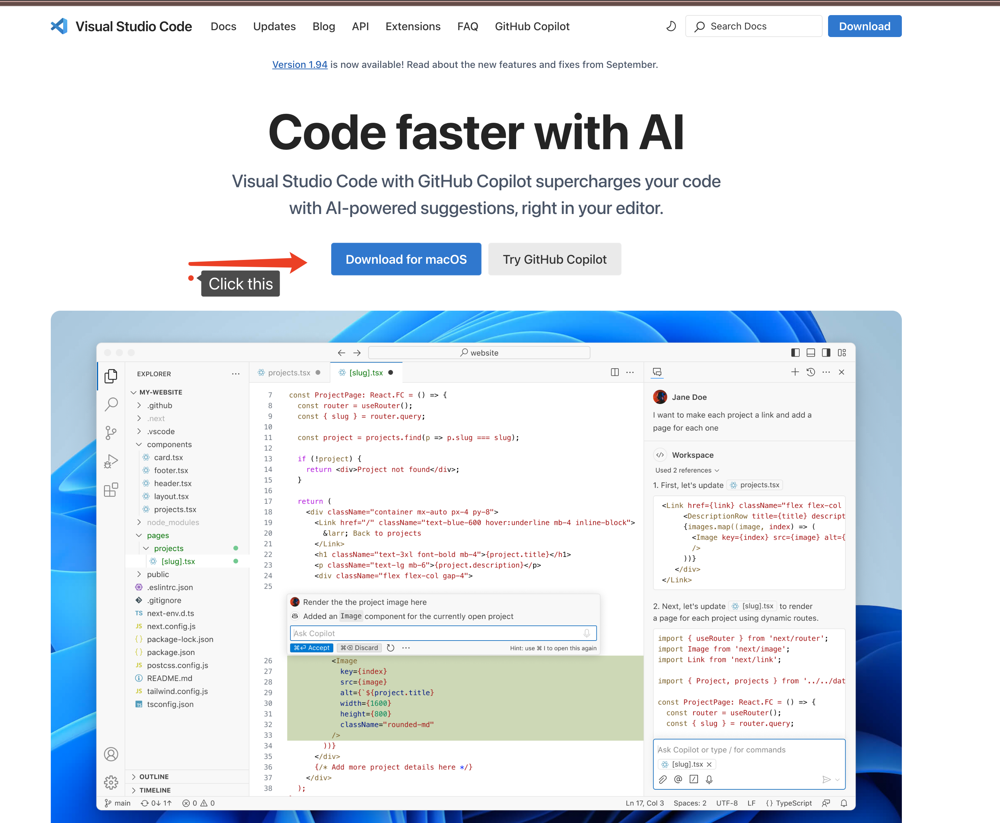
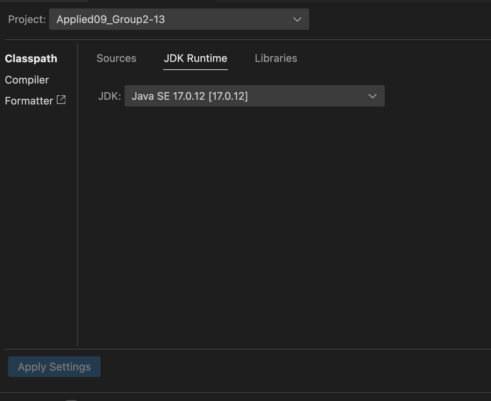

Group: Applied09 Team2
Name:
* Dawen Zhang (34202587)
* Yuebo Feng (34692959)
* Zeyu Gong (34389296)
* Xi He (31159214)

Project Description
    This project is a Java-based application developed for Monash Wellness-Class Booking System (MWBS) to manage registration, booking, cancellation and payment management of fitness classes.

Technology stack
* Programming language: Java
* Language Version: JDK 17
* Development tools: VsCode
* System: Windows, Mac OS, Linux
    

Functionality
    * Admin or member login page
    * View and book available classes
    * For member login
        - view profile
        - view upcoming classes and cancel classes
        - view credit history
        - review feedbacks
        - give feedbacks
    * For admin login
        - Manage Schedule
        - Manage Capacity
        - Add Credit
        - Cancel Class
    * If you want to return to the previous directory, please enter any number or letter outside this directory.
    * If you want to enter the function you want, enter the corresponding number.

1. Installation Guidelines

    Open the terminal at your vscode. And use the "cd" to find your project, for example if your project at desktop, please enter the cd desktop, after that, enter the cd <name_of_project>.
    Running at the terminal
        * Open a terminal and go into the project folder.
        * Enter following command to compile the project:
            javac *.java
        * Enter following command to run the project:
            java MWBS
        * Enter Number:
            - For member login, enter 1
            - For administrator login, enter 2.
        * Then enter function number as prompted to perform the corresponding operation.

    Run the program:
        Find the main program file in the IDE, usually run the main program to start using the system.

    Instructions
        Log in to the system: Log in with the pre-registered email and password.
        Browse courses: After logging in, navigate to the course page to browse and book courses.
        Manage profile: Update or view personal information on the profile page.

    How to download VScode?
        Here is the link of the https://code.visualstudio.com/, please download and install the VScode in your laptop.

2. Trouble Shooting
    1. Trouble Shooting for execution of the project
        1.1 No registor function, for common member, use accont: member@student.monash.edu, password: Monash1234!, to log-in, for common member login. 
        1.2 For administrator, use account: admin@monash.edu, password: Monash1234!, for administrator login.
        1.3 When entering your email address and course name, please pay attention to uppercase and lowercase letters.
    
    2. Trouble Shooting for installation

        Download JDK 17
        Check java Version: 
        * In terminal, you should enter the following command:
            java -version
        * If it didn't display JDK 17, please follow the steps below.
        1. Download the JDK 17 from the link of https://www.oracle.com/java/technologies/downloads/#jdk17-linux,choose the appropriate version based on your system.
        2. 
        At Mac OS:
        * Please use Command + Shift + P to open the VScode command palette:
            Java: Configure Java Runtime.
        * Select JDK Runtime, then click Find a Lock JDK, locate the downloaded JDK file and apply the settings.
        At Windows:
        * Use Control + Shift + P to open the VScode command palette:
            Java: Configure Java Runtime.
        * Select JDK Runtime, then click Find a Lock JDK, locate the downloaded JDK file and apply the settings.
        3. At page of the JDK Runtime, to choose version of the JDK, you can use Find Local a JDK to open the file you downloaded.
        4. If you need any more help, you could watch the video of the link below.
            https://www.youtube.com/watch?v=p-H7Q9PtSc8
        5. Use the java -version to double check the version of the JDK.